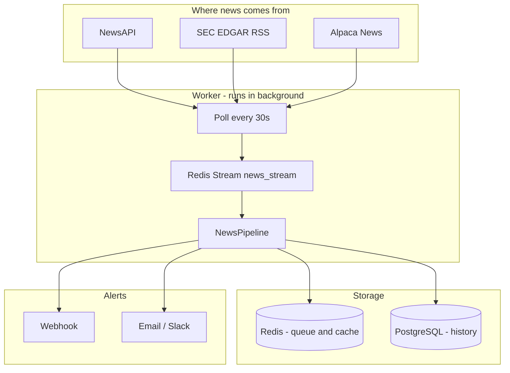

# Real-Time News + Filing Alert System

A portfolio news alert system: watch headlines and SEC filings, filter duplicates, classify what happened, and notify you only when it matters to stocks you hold.

---

## 1. What was the question? (The problem)

Imagine you are a **portfolio manager** at a firm like Franklin Templeton. You hold many stocks (Apple, Google, Tesla, etc.). News breaks all day:

- Earnings reports  
- Mergers and acquisitions  
- CEO changes  
- SEC filings  
- Analyst upgrades  

You cannot read everything manually. You need a system that:

1. **Watches** news and filings automatically  
2. **Understands** what type of event it is (earnings vs M&A vs regulation, etc.)  
3. **Knows** which stories matter to *your* portfolio  
4. **Avoids** sending the same alert 10 times when 10 websites republish the same headline  
5. **Delivers** alerts quickly (target: under **30 seconds** from publication to notification)  

That is the assignment. This project is the answer.

---

## 2. What did we build? (The solution)

We built an **automated pipeline** that runs 24/7 in the background:

```
News sources  →  Redis queue  →  Process (dedupe, classify, match)  →  Save to database  →  Send alert
```

In plain English:

| Step | What happens |
|------|----------------|
| **Fetch** | Every ~30 seconds, pull new articles from NewsAPI, SEC EDGAR RSS, and Alpaca news |
| **Queue** | Put each new story into a **Redis Stream** (a fast message queue) |
| **Process** | For each story: turn text into numbers (embeddings), check if it is a duplicate, guess event type, check if it matches your portfolio |
| **Store** | Save results in **PostgreSQL** (history, metrics, audit trail) |
| **Alert** | If it matches a stock you hold and is not a duplicate → send **webhook** and/or **email** |

You also get a **web API** (Swagger at `/docs`) to add portfolio holdings, ingest test events, and check health/metrics.

---

## 3. What did we use? (Tech stack)

### Languages and frameworks

| Technology | Why we use it |
|------------|----------------|
| **Python 3.12** | Main language; great for async and ML libraries |
| **asyncio + aiohttp** | Non-blocking I/O — fetch many sources without freezing |
| **FastAPI** | REST API with automatic docs (`/docs`) |
| **Uvicorn** | Runs the FastAPI server |

### Data and messaging

| Technology | Why we use it |
|------------|----------------|
| **Redis** | Fast “hot” storage: message queue (Streams), dedup cache, embedding cache |
| **PostgreSQL** | Permanent storage: all events, alerts, portfolio, latency metrics |
| **SQLAlchemy (async)** | Talk to Postgres from Python without blocking |
| **Redis Streams** | Streaming pattern (we did **not** use Kafka — too heavy for this scope) |

### AI / similarity (lightweight, no big training required)

| Technology | Why we use it |
|------------|----------------|
| **sentence-transformers** | Turn headlines into vectors (embeddings) for similarity |
| **scikit-learn** | Cosine similarity to compare embeddings (dedup + classification) |
| **Keyword rules** | Fast event-type detection (earnings, M&A, etc.) before/alongside embeddings |

### External data sources

| Source | What it provides |
|--------|------------------|
| **NewsAPI** | General news headlines (needs `NEWSAPI_KEY`) |
| **SEC EDGAR RSS** | Official filing announcements (free, no key) |
| **Alpaca Markets** | Financial news with ticker symbols (needs API keys) |

### Deployment and quality

| Technology | Why we use it |
|------------|----------------|
| **Docker + Docker Compose** | Run API, worker, Postgres, Redis together with one command |
| **pytest** | Automated tests (30 tests) |
| **Structured JSON logging** | Easy to debug in production |

---

## 4. How does it work? (Step by step)

### The big picture

Two main programs run in Docker:

1. **`api`** — website/API for humans and tools (health, metrics, add holdings, manual ingest)  
2. **`worker`** — background robot that polls news and processes the queue  



### Step A — Ingestion (getting news in)

**File:** `app/ingestion.py`

1. Worker wakes up every `NEWS_POLL_INTERVAL_SECONDS` (default 30).  
2. Calls each source’s `fetch_events()`.  
3. Normalizes the headline (lowercase, clean tickers).  
4. Skips exact duplicates at ingest time (Redis key).  
5. Publishes to Redis stream `news_stream`.  

**Why Redis Stream?** It is like a conveyor belt: many workers can read messages, retry failures, and never lose work if one consumer crashes.

### Step B — Processing (the brain)

**File:** `app/pipeline/orchestrator.py` (`NewsPipeline`)

For each message from the stream:

| Order | Stage | What it does | File |
|-------|--------|--------------|------|
| 1 | **Normalize** | Clean title, body, tickers, build content hash | `app/normalization.py` |
| 2 | **Embed** | Convert text to a number vector (~384 dimensions) | `app/services/embeddings.py` |
| 3 | **Dedupe** | Compare vector to recent stories; if similarity ≥ 0.92 → duplicate | `app/services/deduplication.py` |
| 4 | **Classify** | Label event type: earnings, merger_acquisition, regulation, leadership_change, etc. | `app/services/classifier.py` |
| 5 | **Match portfolio** | Is this about a stock we hold? (ticker, company name, alias like “Alphabet” → GOOGL) | `app/services/matching.py` |
| 6 | **Save** | Write to Postgres: `news_events`, `deduplicated_events`, `latency_metrics` | `app/repositories.py` |
| 7 | **Alert** | Only if **matched** AND **not duplicate** → webhook/email | `app/services/delivery.py` |

**Duplicate example:**  
Reuters and Bloomberg both publish “Apple beats earnings” → second one gets high similarity → stored but **no second alert**.

**Match example:**  
You added holding `AAPL` → headline mentions Apple earnings → **alert sent**.

### Step C — Classification (how we know event type)

We use a **hybrid** approach (no trained ML model file required):

1. **Keywords** — if headline contains “earnings”, “guidance”, “revenue” → likely `earnings`  
2. **Embedding prototypes** — compare headline vector to example sentences per category  
3. **Fallback** — `other` if nothing matches strongly  

Event types include: `earnings`, `merger_acquisition`, `leadership_change`, `regulation`, `analyst_rating`, `product_launch`, `lawsuit`, `bankruptcy`, `other`.

### Step D — Portfolio matching (how we know it matters to you)

**File:** `app/services/matching.py` + `portfolio_matching.py`

Checks in order:

1. **Ticker** — headline or metadata has `AAPL` and you hold `AAPL`  
2. **Company name** — “Apple Inc.” in text and you hold Apple  
3. **Aliases** — “Alphabet” in headline → maps to `GOOGL`  
4. **Subsidiaries** — “Waymo” in headline → maps to `GOOGL`  
5. **Watchlist keywords** — custom keywords per portfolio  

**Important:** If you never add holdings via the API, the pipeline still **processes** news but sends **zero alerts**.

### Step E — Delivery (how alerts go out)

**File:** `app/services/delivery.py`

For each matched holding, try:

- **Webhook** — HTTP POST (e.g. to Slack, Teams, or `https://httpbin.org/post` for testing)  
- **Email** — SMTP  
- **Slack** — Slack incoming webhook URL  

If delivery fails → message goes to Redis stream `notification_delivery_failures` → **replay worker** retries later.

### Step F — API (how you control it)

**File:** `app/api.py` — open http://localhost:8000/docs

| Endpoint | Purpose |
|----------|---------|
| `GET /health/live` | Is the API process alive? |
| `GET /health/ready` | Are Postgres + Redis connected? |
| `GET /metrics` | How many events processed? Alerts sent? Avg latency per stage? |
| `POST /portfolio/holdings` | Add a stock you want alerts for |
| `POST /events/ingest` | Manually inject a test headline |
| `GET /events` | List processed stories |
| `POST /portfolio/match` | Test matching without full pipeline |

---

## 5. Project structure (where code lives)

```
news-alert-system/
├── app/
│   ├── main.py              # Starts FastAPI
│   ├── worker.py            # Starts background poller + consumer + replay
│   ├── api.py               # HTTP routes
│   ├── config.py            # All settings from .env
│   ├── ingestion.py         # Poll news sources → Redis
│   ├── pipeline/
│   │   └── orchestrator.py  # Main processing pipeline
│   ├── streams/
│   │   ├── producer.py      # Write to Redis Stream
│   │   └── consumer.py      # Read from Redis Stream
│   ├── sources/             # NewsAPI, SEC, Alpaca adapters
│   ├── services/            # Embed, dedupe, classify, match, deliver
│   ├── models.py            # Database tables
│   └── repositories.py      # Database queries
├── tests/                   # 30 automated tests
├── docker-compose.yml       # Run everything
├── Dockerfile
├── requirements.txt
└── .env.example             # Copy to .env and add API keys
```

---

## 6. How to run it

### Prerequisites

- Docker Desktop installed and running  
- API keys in `.env` (copy from `.env.example`)

```bash
cd news-alert-system
cp .env.example .env
# Edit .env — add NEWSAPI_KEY, ALPACA_API_KEY, ALPACA_API_SECRET (optional but recommended)

docker compose up --build
```

| URL | What |
|-----|------|
| http://localhost:8000/docs | Interactive API (Swagger) |
| http://localhost:8000/health/ready | System health |
| http://localhost:8000/metrics | Pipeline stats |

### Run tests (without Docker)

```bash
python -m venv .venv
source .venv/bin/activate   # Windows: .venv\Scripts\activate
pip install -r requirements.txt
pytest tests/ -q
```

---

## 7. How to prove it works (5-minute demo)

1. Open http://localhost:8000/docs  
2. **POST `/portfolio/holdings`** — add Apple:

```json
{
  "portfolio_name": "Core",
  "ticker": "AAPL",
  "company_name": "Apple Inc.",
  "active": true,
  "webhook_url": "https://httpbin.org/post"
}
```

3. **POST `/events/ingest`** — fake earnings story:

```json
{
  "source": "demo",
  "source_event_id": "demo-1",
  "title": "Apple reports strong earnings and raises guidance",
  "body": "Apple beat revenue estimates.",
  "url": "https://example.com/demo-1",
  "published_at": "2026-05-23T12:00:00+00:00",
  "tickers": ["AAPL"]
}
```

4. Wait 3–5 seconds.  
5. **GET `/metrics`** — you should see:
   - `total_events_processed` increased  
   - `total_alerts_dispatched` ≥ 1  
6. **GET `/events`** — find your demo story with `event_type` like `earnings`.

Watch worker logs:

```bash
docker compose logs -f worker
```

---

## 8. Design choices (good to mention in interviews)

| Topic | Our choice |
|-------|------------|
| **Streaming vs batch** | Near-real-time polling + Redis Streams (not overnight batch jobs) |
| **Why not Kafka?** | Redis Streams is enough for portfolio-scale volume; simpler to operate |
| **Dedup** | Embedding similarity (threshold 0.92) + ingest-time URL/hash dedupe |
| **Classification** | Keywords + embedding prototypes (fast, no GPU training) |
| **Cold-start tickers** | Aliases (“google” → GOOGL), subsidiaries, watchlist keywords |
| **Latency** | Processing ~0.6s per event; poll interval (30s) is the main delay |
| **Reliability** | Retries, dead-letter queue, delivery replay, graceful shutdown |

---

## 9. What we did NOT build (honest limits)

- Real-time WebSocket feeds (we **poll** on a timer)  
- A trained neural classifier (we use rules + embeddings)  
- Automatic company detection for every unknown name (needs aliases/holdings)  
- Kafka or Kubernetes (Docker Compose is enough for this project)  

---

## 10. One-sentence summary

**We built an async news alert system that polls financial news and SEC filings, deduplicates similar headlines with embeddings, classifies event types, matches stories to a portfolio holdings list, and sends webhook/email alerts — all under 30 seconds end-to-end, with Postgres for history and Redis for streaming.**
