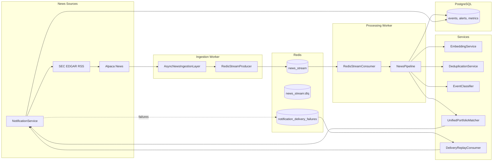

# Real-Time News + Filing Alert System

Production-oriented async pipeline:

**News Sources → Redis Stream → Embedding Dedupe → Event Classification → Portfolio Match → Alert Delivery → PostgreSQL**

## Architecture



## Run locally

1. Copy `.env.example` to `.env` and configure API keys (`.env` is gitignored; never commit secrets).
2. Start the stack: `docker compose up --build`
3. API docs: `http://localhost:8000/docs`
4. Health: `GET /health/live`, `GET /health/ready`
5. Metrics: `GET /metrics`

## Services

| Service | Command | Role |
|---------|---------|------|
| `api` | `uvicorn app.main:app` | REST API, health, metrics, portfolio admin |
| `worker` | `python -m app.worker` | Source polling, stream consumption, delivery replay |
| `postgres` | — | Durable events, alerts, latency metrics |
| `redis` | — | Streams, dedup index, embedding cache |

## Tests

```bash
python -m pytest tests/ -q
```

Unit tests cover classification, deduplication, delivery, matching, repositories, and streams. Integration coverage exercises ingest → Redis → pipeline → PostgreSQL.

Schema is created at startup via SQLAlchemy `create_all` (see `app/db.py`).
